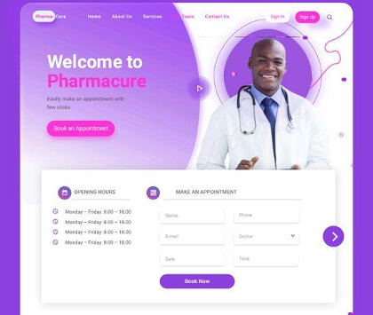

# Appointment-Booking-System
An Appointment Booking System for clinics and hospitals
## Table of contents
* [General info](#general-info)
* [Screenshots](#screenshots)
* [Technologies](#technologies)
* [Setup](#setup)
* [Features](#features)
* [Status](#status)
* [Inspiration](#inspiration)
* [Contact](#contact)

## General info
AppDoc is a health booking app that will be aid in scheduling an appointment with your doctor in any hospital in Nigeria. The purpose of this project is to reduce the number of crowd that books appointment with the doctor offline when it could be done in a more convenient way.

## Screenshots

## Technologies
* Html
* CSS
* Javascript
* Django --Version 3.1.2

## Status
Project is: _in progress_

## Inspiration

## Contact
Created by #web-health-16
